# kasseh.com

Content repository for [www.kasseh.com](https://www.kasseh.com) and the
Against Entropy newsletter. Includes blog post source files, SEO metadata,
and a multi-agent content production workflow for Claude Code.

**Canonical URL:** `https://www.kasseh.com` (always with `www`)

## Structure

```
kasseh.com/
  posts/                              # Blog posts (one folder per article)
    {slug}/
      post.md                         # Markdown content
      meta.json                       # SEO metadata
      schema.json                     # JSON-LD for Ghost code injection
      images/                         # Downloaded post images
  orgs/
    organizations.json                # Reusable Organization schema library
  templates/
    article-schema.json               # Base schema template for new posts
  scripts/
    ghost_sync.py                     # Ghost CMS → repo sync
  skills/                             # Claude Code skills
    kasseh-writing-guide/SKILL.md     # Voice, archetypes, language rules
    kasseh-voice-reference/SKILL.md   # Published article excerpts for calibration
    kasseh-ghost-sync/SKILL.md        # Ghost sync skill documentation
    orchestration/content-debate.md   # Content debate workflow rules
  agents/                             # Claude Code agents
    content-shaping/
      kasseh-thesis-agent.md          # Proposes and defends the argument
      kasseh-adversary-agent.md       # Stress-tests the thesis
      kasseh-structure-agent.md       # Designs essay architecture
    content-production/
      kasseh-draft-agent.md           # Writes prose section by section
      kasseh-editor-agent.md          # Flags violations, produces edit reports
      kasseh-ghost-publisher.md       # Packages files for Ghost publication
```

## Installation

### Link skills and agents for Claude Code

From the repo root:

```bash
cd "/Users/kasseh/Projects/Personal Utilities/kasseh.com"

# Skills
mkdir -p .claude/skills
ln -sf "$(pwd)/skills/kasseh-writing-guide" .claude/skills/kasseh-writing-guide
ln -sf "$(pwd)/skills/kasseh-voice-reference" .claude/skills/kasseh-voice-reference
ln -sf "$(pwd)/skills/kasseh-ghost-sync" .claude/skills/kasseh-ghost-sync

# Agents
mkdir -p .claude/agents
ln -sf "$(pwd)/agents/content-shaping/kasseh-thesis-agent.md" .claude/agents/kasseh-thesis-agent.md
ln -sf "$(pwd)/agents/content-shaping/kasseh-adversary-agent.md" .claude/agents/kasseh-adversary-agent.md
ln -sf "$(pwd)/agents/content-shaping/kasseh-structure-agent.md" .claude/agents/kasseh-structure-agent.md
ln -sf "$(pwd)/agents/content-production/kasseh-draft-agent.md" .claude/agents/kasseh-draft-agent.md
ln -sf "$(pwd)/agents/content-production/kasseh-editor-agent.md" .claude/agents/kasseh-editor-agent.md
ln -sf "$(pwd)/agents/content-production/kasseh-ghost-publisher.md" .claude/agents/kasseh-ghost-publisher.md
```

Verify:

```bash
ls -la .claude/skills/
ls -la .claude/agents/
```

Every line should show the symlink arrow pointing to a valid path.

### Append orchestration rules

To enable the full content debate workflow, append the orchestration
rules to your CLAUDE.md:

```bash
cat skills/orchestration/content-debate.md >> CLAUDE.md
```

## Available Skills and Agents

### Skills

| Skill | Invocation | Purpose |
|-------|------------|---------|
| **kasseh-writing-guide** | `/kasseh-writing-guide` | Voice calibration, structural archetypes, language rules, pre-publish checklist. Loaded by thesis, structure, and draft agents. |
| **kasseh-voice-reference** | `/kasseh-voice-reference` | Published article excerpts as tone/rhythm calibration. Loaded by thesis and draft agents. |
| **kasseh-ghost-sync** | `/kasseh-ghost-sync` | Sync published posts from Ghost CMS to the repo. |

### Content Shaping Agents

| Agent | Invocation | Model | Purpose |
|-------|------------|-------|---------|
| **kasseh-thesis-agent** | `/kasseh-thesis-agent` | Opus | Takes a topic seed, produces a hardened thesis document. Loads writing-guide and voice-reference skills. |
| **kasseh-adversary-agent** | `/kasseh-adversary-agent` | Opus | Stress-tests the thesis from vendor/practitioner perspectives. Finds the strongest counterarguments. |
| **kasseh-structure-agent** | `/kasseh-structure-agent` | Opus | Selects a structural archetype and designs the section-level brief. Loads writing-guide skill. |

### Content Production Agents

| Agent | Invocation | Model | Purpose |
|-------|------------|-------|---------|
| **kasseh-draft-agent** | `/kasseh-draft-agent` | Opus | Writes prose section by section against the structural brief. Loads both skills. |
| **kasseh-editor-agent** | `/kasseh-editor-agent` | Opus | Reviews draft for violations. Produces edit report. Does not rewrite. |
| **kasseh-ghost-publisher** | `/kasseh-ghost-publisher` | Sonnet | Packages approved draft into post.md, meta.json, schema.json. Mechanical. |

## Content Debate Workflow

The full workflow runs six phases with user checkpoints between major
gates. Activate it by saying "write about [topic]" with the orchestration
rules in CLAUDE.md.



You can start at any phase. "I have a draft, just run the editor" is
valid. "Here's a thesis, skip to structure" is valid.

## Manual Workflow

For posts written without the debate pipeline.

### Creating a new post

1. Create folder: `posts/{slug}/`
2. Write content: `post.md` (no `#` H1 header, Ghost uses the title)
3. Create `meta.json`:
   - `metaTitle`: max 60 characters
   - `excerpt`: max 300 characters
   - `metaDescription`: max 145 characters
4. Create `schema.json` from `templates/article-schema.json`:
   - Fill in headline, description, keywords
   - Add organizations to `mentions` array (check `orgs/organizations.json` first)
   - Wrap in `<script type="application/ld+json">` tags
   - Use `https://www.kasseh.com` for all URLs
   - Set `datePublished`/`dateModified` as placeholders until publish

### Publishing to Ghost

1. Paste Markdown from `post.md` into Ghost editor
2. In post settings: set meta title, meta description, excerpt from `meta.json`
3. In Code injection, Post Header: paste contents of `schema.json`
4. Publish
5. Update `datePublished`/`dateModified` in `schema.json`
6. Validate with [Google Rich Results Test](https://search.google.com/test/rich-results)
7. Commit to git

### Syncing from Ghost

When content is written or edited directly in Ghost, sync back to the repo:

```bash
uv run scripts/ghost_sync.py
```

Requires [1Password CLI](https://developer.1password.com/docs/cli/) (signed in)
and [uv](https://docs.astral.sh/uv/). The Ghost Content API key is read from
`op://Private/ghost-content-api-key/credential`.

The script fetches all published posts, writes `post.md`, `meta.json`,
`schema.json`, and downloads images. Only files that differ are updated.

## Writing Rules

The full rules live in `skills/kasseh-writing-guide/SKILL.md`. Key points:

- No em dashes (use commas, colons, periods, parentheses)
- No AI-sounding phrases ("leverage," "landscape," "cutting-edge," "delve")
- No negative contrast structures ("it's not X, it's Y")
- Punctuation outside quotation marks (British/logical style)
- Real tool names, column names, specific scenarios
- Start with problems, not solutions
- Acknowledge tradeoffs honestly

## Structural Archetypes

Essays use one of six structural patterns (or a blend). The structure-agent
selects based on the thesis:

- **The Accumulation**: Stack observations until the pattern is undeniable
- **The Inversion**: Build the conventional wisdom, then turn it inside out
- **The Zoom**: Start at a single column name, pull back to systemic pattern
- **The Case File**: One narrative with tension, analysis rides the story
- **The Ratchet**: Each section raises the stakes, pressure cooker to release
- **The Reframe**: Let the reader settle into the wrong framing, then pivot

Full definitions with examples and reference writers in `skills/kasseh-writing-guide/SKILL.md`.

## Updating

Pull to get the latest. Symlinks mean changes propagate immediately:

```bash
cd "/Users/kasseh/Projects/Personal Utilities/kasseh.com" && git pull
```
