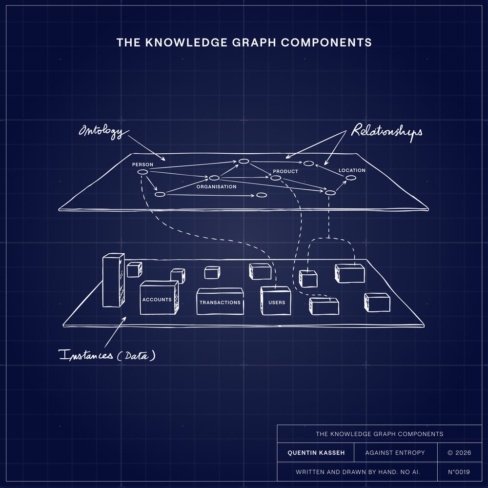
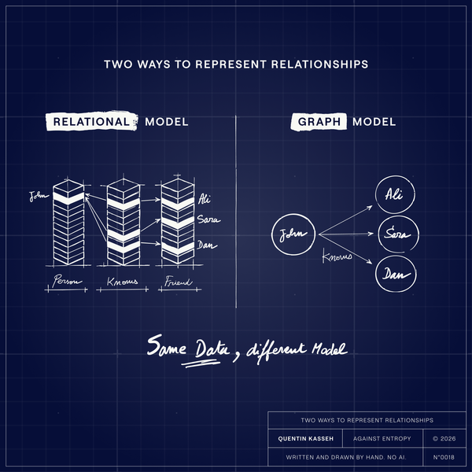

Last week, in one of our Learn and Share sessions at [Syntaxia](https://www.syntaxia.com/?ref=kasseh.com), one of our senior engineers was walking through how we'd implement a particular data grounding pattern. He was deep into the architecture, talking about ontology layers and relationship constraints, when our intern, a few weeks into the job and fresh out of school, raised his hand.

> "But isn't a knowledge graph just something like Neo4j? Or maybe RelationalAI?"

Good question. Honest question. And exactly the misconception that most of the data industry shares with him.

We paused the session and spent the next twenty minutes on it. Because this confusion isn't a junior engineer problem. I hear the same thing from data leaders, solution architects, and vendor sales teams. People hear "knowledge graph" and immediately reach for a product. They think it's something you buy. Something you install. A database with a different query language and a marketing team that uses the word "semantic"...

It's not. A knowledge graph is a pattern. It's what emerges when you combine three things correctly. And once you understand those three things, you realize you might already have the pieces. You also realize why most implementations fail.

****A note before we go further.**** This is a deliberately simplified explanation. There are real technical distinctions between knowledge graphs, knowledge bases, inference-capable systems, and various approaches to semantic modeling. Entire academic careers are built on these distinctions.   
We're not getting into any of that here. This is a ****practical**** ****starting point****: what a knowledge graph is, what its components are, and why it's not the same thing as a graph database.   
If you walk away remembering those three components, you're ahead of most people buying graph technology today.

## What a Knowledge Graph Actually Is

A knowledge graph is formed by the combination of three distinct components:

**An ontology.** This is the blueprint. The schema. It defines the concepts that exist in your domain and the rules that govern them. Not column names. Not table structures. Actual definitions of what things mean and how they relate to each other conceptually. An ontology says: "A Customer is an entity that has a relationship to an Account. An Account can be Active or Inactive. Active means the customer has logged in within 30 days".

**Instances.** This is the data. The actual, concrete entities that populate your blueprint. If the ontology defines what a Customer is, the instances are the real customers in your system.

**Relationships.** These are the edges. The connections between instances, typed and constrained by the ontology. For example:

- "Syntaxia *is a customer of* Product X",
- "Jane Smith *manages* Account 4471",
- "Account 4471 *belongs to* Syntaxia"

Each relationship has a defined type, a direction, and a meaning that the ontology makes explicit.

The Knowledge Graph Components

****That's it.**** Ontology + instances + relationships = knowledge graph

**Notice what's missing from that equation:** any mention of a specific technology.

## A Graph Database Without an Ontology Is Just a Database

When people confuse the pattern with the product, they make a predictable mistake. They buy a graph database, load some data into it, and call it a knowledge graph. Then they wonder why it didn't solve their data quality problems.

A Database is a just a Data Base

Here's why: a graph database without an ontology is just a different shape of chaos. You've moved your data from rows and columns into nodes and edges, but you haven't defined what anything means. You haven't formalized the concepts. You haven't captured the rules. You've changed the syntax without addressing the semantics.

This is the equivalent of reorganizing a messy closet into a bigger closet. More space, same disorder.

The ontology is what makes a knowledge graph a *knowledge* graph. Without it, you have a graph database. With it, you have something that can actually enforce meaning across your organization.

## You Can Build a Knowledge Graph With Your Existing Stack

Here's where it gets practical.

Because a knowledge graph is a pattern, not a product, each of the three components can be implemented with different technologies. You don't need one tool that does everything. You need three capabilities, and you get to choose how you deliver each one.

**Ontology tools.** Your blueprint can live in OWL (Web Ontology Language), built using something like Protégé, the open-source ontology editor from Stanford. It can live in RDFS (RDF Schema) if you need something lighter.   
It can even start as a well-structured data dictionary in a **spreadsheet**, though you'll outgrow that quickly.   
The point is: the ontology is a formal description of your domain. The tool you use to create and manage it is a separate decision from how you store your data.

**Instance storage.** Your actual data, the nodes, can live in a relational database. It can live in Snowflake. It can live in a document store. The instances don't care about the storage engine. What matters is that they conform to the ontology. A customer record in Postgres is a valid instance if it maps to a class defined in your ontology.

**Relationship management.** The edges can be foreign keys in a relational database. They can be explicit graph edges in Neo4j. They can be computed dynamically through a knowledge graph engine like [RelationalAI layered on top of Snowflake](https://www.kasseh.com/knowledge-graphs-on-snowflake/). They can also be business logic written in a programming language, encoded in dbt models, stored procedures, or application code.   
When your Python script says "*a customer is active if they have a signed contract within the last 12 months*" that's a relationship definition.   
It's just living in code instead of in a graph. The technology you use to express, traverse, and query relationships is, again, a separate choice.

This should be freeing. It means you don't have to rip out your existing data infrastructure to start building a knowledge graph. You can build a genuinely **data-centric** system with the tools you already have. But it gets tricky. Your relationship definitions end up split across multiple layers: some in the database schema, some in application logic, some in transformation pipelines. Keeping all of that consistent with a single ontology requires discipline. You're essentially coordinating the three components of a knowledge graph by hand, across different technologies, maintained by different teams, on different release cycles.

Which is exactly why some organizations look for a platform that handles all three in one place.

## The All-in-One Platform Approach

The alternative is a technology that combines ontology management, instance storage, and relationship traversal into a single system.

**Neo4j** is the most well-known example. It stores nodes and edges natively as a labeled property graph. You can define types and constraints that function as a lightweight ontology. And the Cypher query language lets you traverse relationships efficiently. For teams that want a unified environment, this works.

**RelationalAI** layers graph capabilities directly into Snowflake, which means you can build knowledge graph patterns on top of the warehouse you already use. For organizations with significant Snowflake investments, this avoids the "second database" problem entirely.

There are others in the space, each making different tradeoffs between standards-based semantic web approaches and more pragmatic property graph approaches.

The choice between assembling the components yourself and buying a platform that bundles them depends on where you're starting and how much organizational commitment you have.

Both paths can produce a real knowledge graph, but neither path works without all three components.

## How to Start Building a Knowledge Graph Without New Technology

You don't need to boil the ocean to start.

### Step 1/3: Pick one business term

Pick one business term. Just one. "Customer," "Revenue," "Active User," whatever word causes the most arguments in your org. Write down what it means: the **properties**, the **constraints**, the **relationships** to other concepts. Get the relevant stakeholders in a room and make them agree on that definition. Then document it in version control, **not** in a Google Doc or a Confluence page that will be forgotten by next month.

Congratulations. You've just built an ontology.

### Step 2/3: Map it

Now map it to your stack. Which tables hold these entities? Which foreign keys already encode some of these relationships? Which dbt models or application code enforce the constraints? You're looking for where the pieces of your ontology already live, scattered across databases, pipelines, and services.

### Step 3/3: Fill in the gaps

Now fill in the gaps. Where are relationships implied but never formalized? Where does a constraint exist in one system but not another?   
Implement what's missing. Add the foreign key. Write the validation. Formalize the logic that's missing.

**Done.** You've just built a [tiny knowledge graph](https://grokipedia.com/page/Knowledge_graph?ref=kasseh.com). No new technology required. You could do this with a spreadsheet, a Git repo, and a few honest conversations.

From there, you can decide whether you need a graph database, an ontology editor, or a platform that handles all three. But you'll be making that decision from a position of understanding, **not from a vendor's sales deck**.

## Knowledge Graph vs. Graph Database

A knowledge graph is a graph database.

It's the combination of a formal ontology, concrete instances, and defined relationships.

Each component can be implemented with different tools, or all three can live in a single platform.

The technology conversation is seductive because it's concrete. Install this. Configure that. Run a query. See results.   
But the **value of a knowledge graph lives in the ontology, not the database**. It lives in the hard work of defining what your business concepts mean and enforcing those definitions across every system that touches them.

**The next time someone pitches you a knowledge graph solution, ask yourself whether they're selling you a technology or helping you build the pattern.**

The technology is the easy part. The pattern is where the value lives.

💡

****A note on process****  
Everything you just read was written by a human.   
The illustrations were drawn by hand. I don't use AI to generate content for Against Entropy.   
If you want to know why, or how these essays come together, [here's the process.](https://www.kasseh.com/why-i-dont-use-ai-to-write/)
