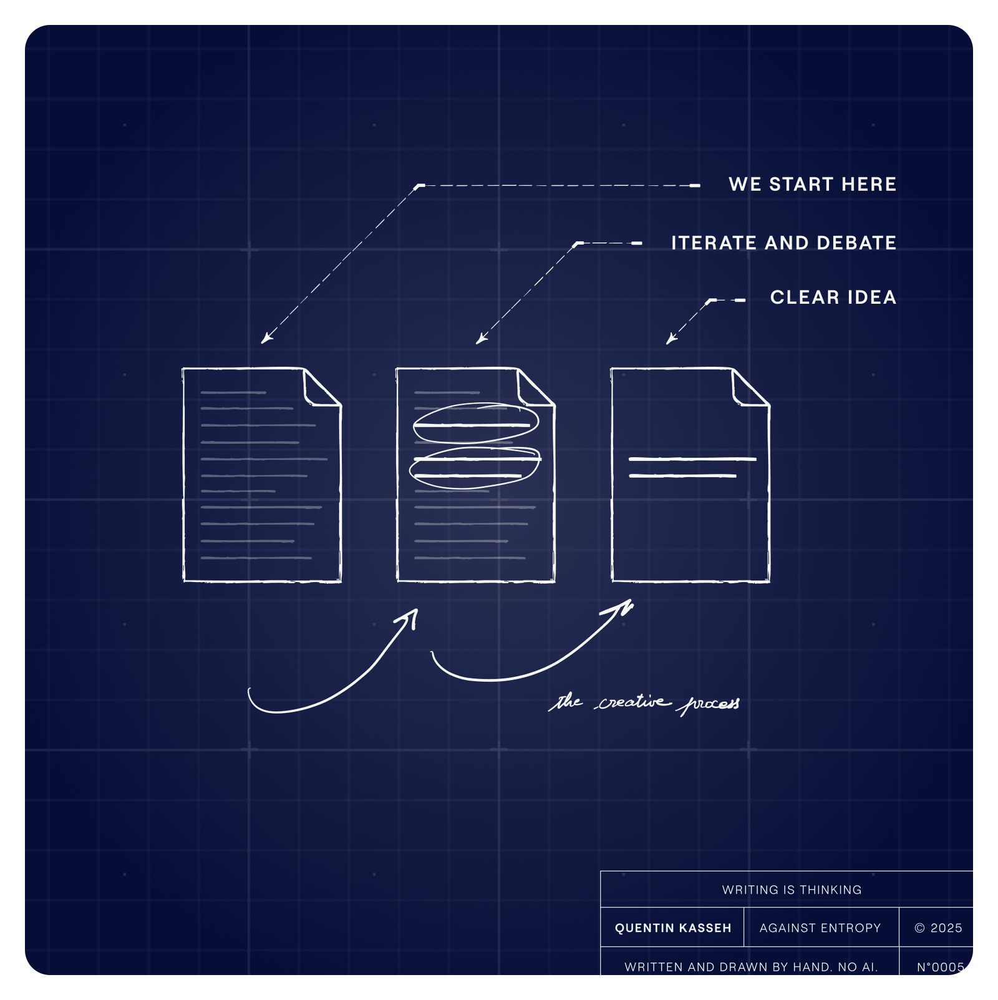
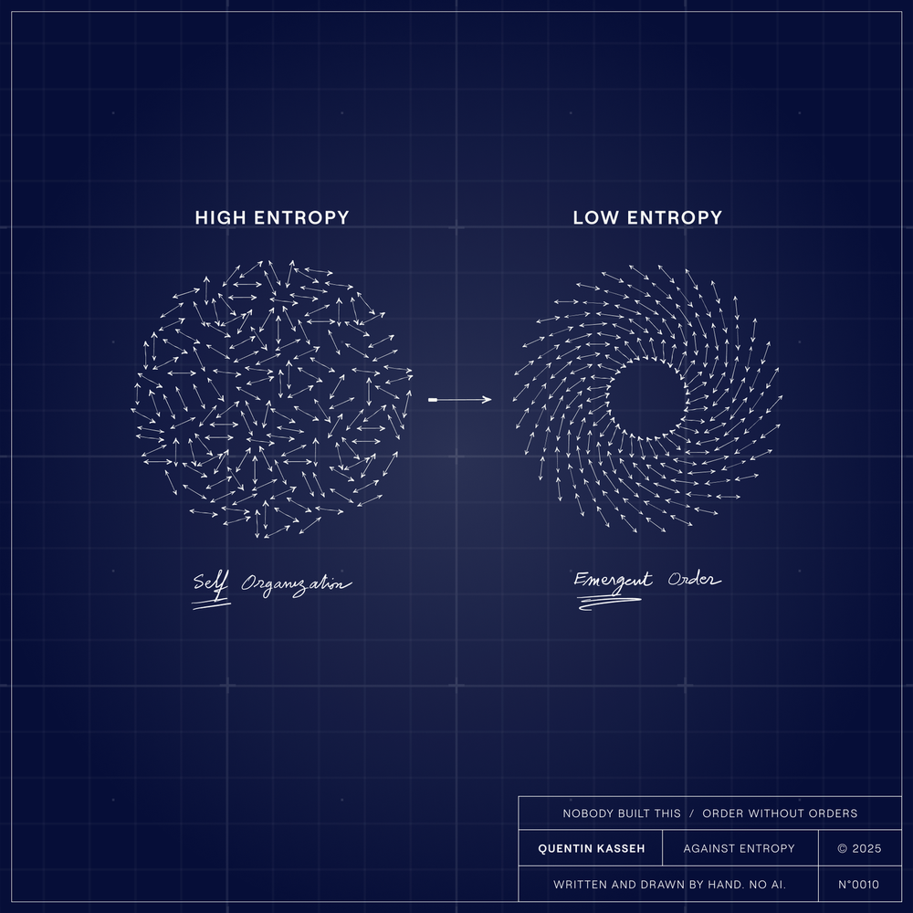
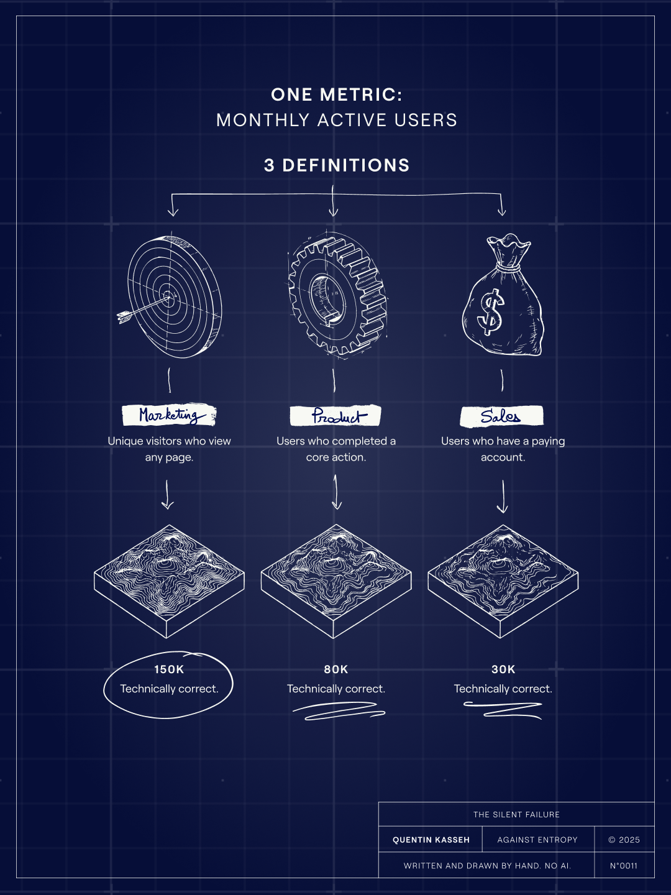
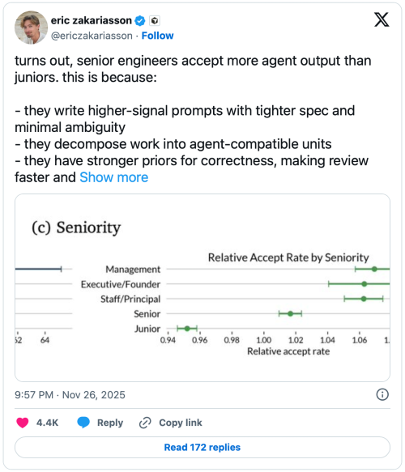
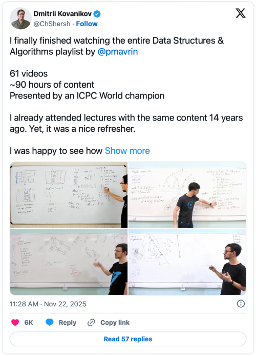
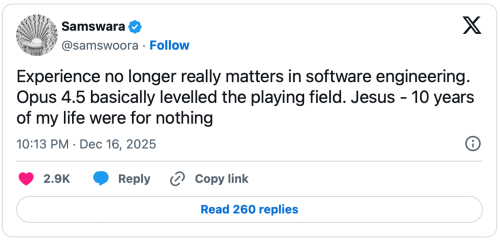

I owe you an email.

You subscribed to Against Entropy. Some of you weeks ago. And I've been publishing posts, building out the site, figuring out the rhythm of this thing. But I haven't actually sent you anything.

So here we are. The first dispatch. A little late, a little rough around the edges. That feels appropriate.

## What I've Been Building

I started this blog in late November. No grand launch. No Twitter thread announcing my arrival. I'd been frustrated for a while that most writing about data infrastructure is either vendor marketing or academic abstraction. Neither helps you build things that work.

I wanted to write about the problems nobody talks about. The ones that aren't solved by buying another tool. The ones that require you to think.

Five weeks later, I have four posts live. Let me walk you through them.

### [Why I Don't Use AI to Write](https://www.kasseh.com/why-i-dont-use-ai-to-write/)

This was the first real post. A manifesto, maybe. Or just an explanation for why everything here takes longer than it should.

Writing is thinking

I use AI for research. I use Grammarly for typos. But I don't ask machines to write my essays. The reason isn't purity or principle. It's that writing is how I think. Outsourcing the writing means outsourcing the thinking. And if I'm not thinking, what exactly am I offering you?

The same goes for the illustrations. Every diagram in these essays is made by hand, by me and my team. It takes longer. But the act of drawing something forces you to understand it. Generated images skip that step (they look fine. They mean nothing.)

I referenced Martin Scorsese in that piece. His line about the most personal being the most creative. It applies to technical writing more than people realize.

### [What the Hell Is Entropy?](https://www.kasseh.com/what-the-hell-is-entropy/)

I kept having conversations where I'd say "entropy" and watch smart people nod while clearly having no idea what I meant. So I wrote this.

No body built this

Entropy isn't chaos. It's not randomness. It's the tendency of everything to drift toward the most probable state. Cream in coffee. Data in systems. Organizations over time. The math says things could spontaneously organize themselves. The math also says you'll be waiting longer than the universe has existed.

The newsletter is called **Against Entropy for a reason**. The work I care about is building structures that hold. Systems that resist decay. That's harder than it sounds, and it's what I want to write about.

### [Xoximilco](https://www.kasseh.com/xoximilco/)

This one is different. Just a night in Mexico.

I was in Mexico during Christmas. A tour guide named Miyera told me about her brother, an artist who wanders Colombia chasing his flame. She saw something similar in me. She sent me to Xoximilco.

Music by the canal

Two hours later I was on a boat in a canal, surrounded by Latin families celebrating something deeply Mexican, something I had no right to be part of. I was the only English speaker. I understood maybe 40% of what was happening. It was one of the best nights I've had in years.

I don't know if personal essays belong in a newsletter about data infrastructure. But I'm not interested in being a content machine. Sometimes you write what's in front of you.

### [The Two Ways Your Data Lies to You](https://kasseh.com/semantic-drift-vs-syntactic-drift/?ref=kasseh.com)

This is the technical piece. The one I've been building toward.

**Syntactic** drift is when the structure of your data changes. A column disappears. A type shifts. Your pipeline breaks loudly. Annoying, but manageable. The tools catch it.

**Semantic** drift is when the meaning changes but the structure stays identical. The column is still called `customer_status`. It still contains strings. But six months ago "active" meant one thing, and now it means something else. Nothing breaks. Your dashboards still render. Your executives still make decisions. They just make them on data that no longer means what they think it means.

Semantic drift in action

We've spent a decade building tools for the first problem. We have almost nothing for the second. And the second is the one that actually destroys companies.

I've been thinking about this for years. This essay is my attempt to make the problem concrete.

## What Caught my Eye on X

## What's Next

I don't have a content calendar. I don't have a roadmap. I have a list of problems I can't stop thinking about, and I'm working through them one at a time.

**Some upcoming topics:** knowledge graphs on Snowflake. Why the semantic layer doesn't solve what people think it solves. The real cost of data debt. Maybe something about how organizations decay (entropy again, always entropy).

I'll be sending these dispatches regularly now. Weekly, maybe bi-weekly. Short updates, links to new posts, and occasionally something that doesn't fit anywhere else.

Thanks for being here. Thanks for reading.

See you soon.

*Quentin*

---

*Against Entropy is where I write about data infrastructure, semantic drift, and **the problems vendors won't discuss**. If someone forwarded this to you and you want to subscribe, you can do that*[*here*](https://kasseh.com/?ref=kasseh.com)*.*

💡

****A note on process****  
Everything you just read was written by a human.   
The illustrations were drawn by hand. I don't use AI to generate content for Against Entropy.   
If you want to know why, or how these essays come together, [here's the process.](https://www.kasseh.com/why-i-dont-use-ai-to-write/)
