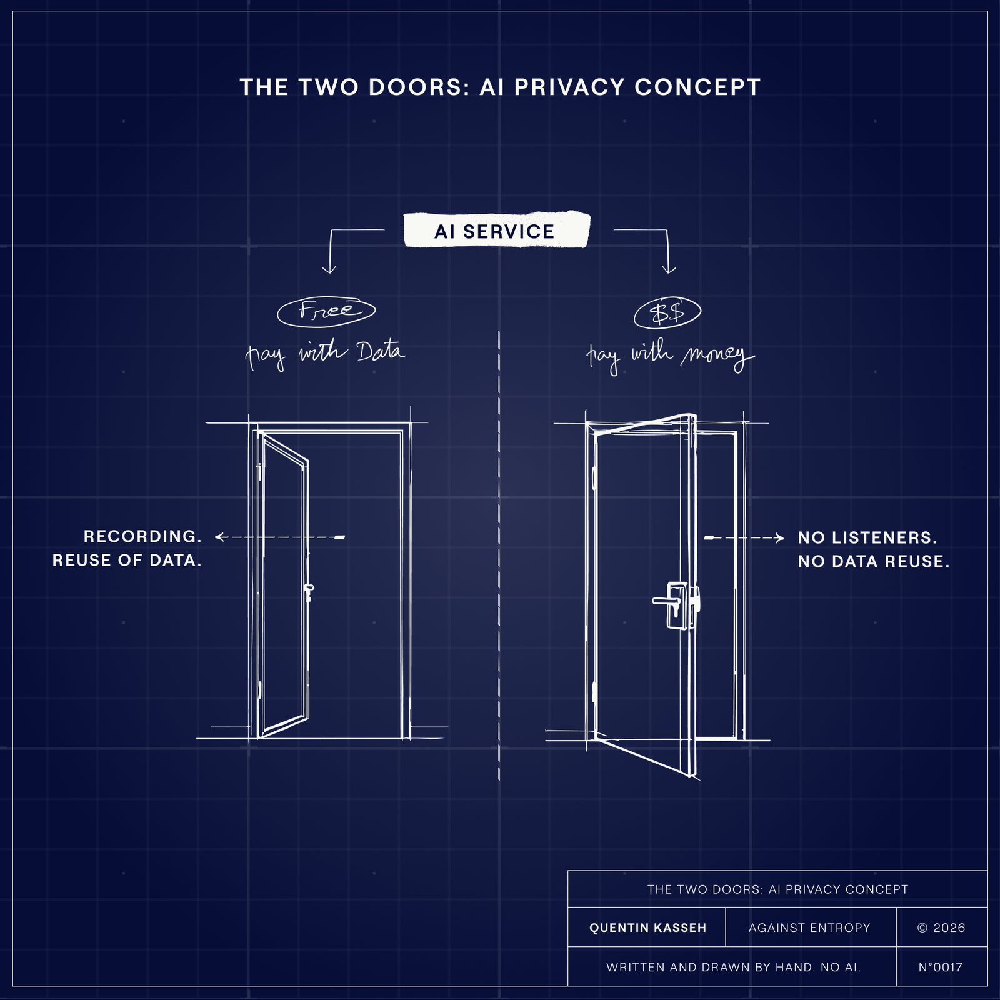
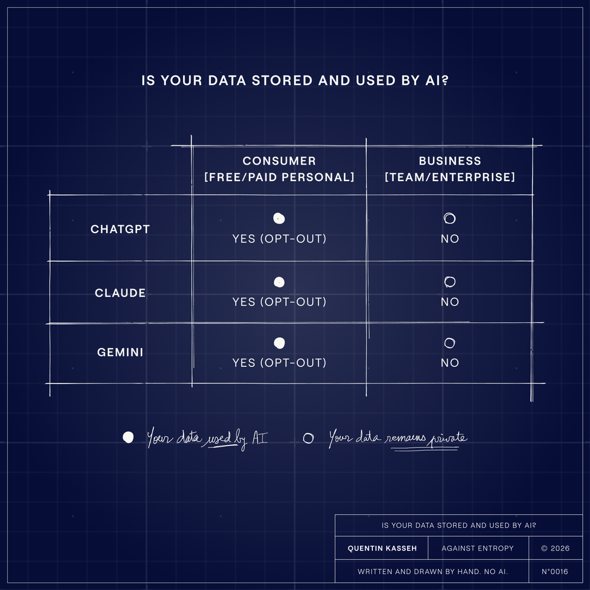

Last week, my wife Sara told me she doesn't have a personal account with any AI tool, yet.

She's an operations manager at a tech company. She uses Gemini and ChatGPT through her corporate accounts, but always with one foot out the door. Every prompt gets a mental audit before she hits enter.   
Is this too specific? Does this reveal something I shouldn't share?   
She treats the AI like a colleague she doesn't fully trust: useful, but you watch what you say around them.

When I asked about the anxiety, she just shook her head: "I don't know what they do with my data. I don't know who's reading it. It feels like I'd be handing over too much".

She's not wrong to be cautious. A Stanford study found that 70% of adults don't trust companies to use AI responsibly. 81% expect their personal information to be misused.

The anxiety is everywhere. And it's keeping a lot of capable people from getting full value out of tools they already find impressive.

So I did what I do when something feels murky: I read the policies. All of them. For ChatGPT, Claude, and Gemini. The consumer terms. The enterprise terms. The privacy notices. The FAQs buried three clicks deep.

What I found was clarifying. Not reassuring, exactly. But clarifying.

## The Two Doors

Imagine walking into a building with two entrances. The door on the left is free, brightly lit, and leads to a room with one-way mirrors. Everything you say gets recorded. People you can't see might listen in. The building owners can use your conversations to improve their other products.

The door on the right costs money. It leads to a private conference room. Your conversations stay between you and the service. No recordings. No listeners. No reuse.

Both doors lead to the same AI, same building. The quality of the service is essentially identical. The only difference is what happens to your data afterward.

The 2 Doors: Free Entry vs. Paid Entry

This is the fundamental split in AI privacy today. And almost nobody explains it clearly.

## What Actually Happens to Your Data

Let me walk through the three major providers. The details matter.

### **ChatGPT (OpenAI)**

**If you use a free or Plus accoun**t, your conversations can be used to train future models. This is the default. OpenAI will retain your data, and human reviewers may read your conversations to improve the system.

You can opt out. Go to Settings, then Data Controls, and toggle off "Improve model for everyone". Once you do this, new conversations won't be used for training. But most users never find this setting.

**If you use ChatGPT Enterprise or Team** (the business tiers), the default flips. Your data is not used for training. Period. This isn't buried in the fine print. OpenAI states it explicitly ([details here](https://help.openai.com/en/articles/5722486-how-your-data-is-used-to-improve-model-performance?ref=kasseh.com)):

> "By default, we do not train on any inputs or outputs from our products for business users".

### **Claude (Anthropic)**

Claude changed its consumer privacy policy in late 2025 ([check here](https://www.anthropic.com/news/updates-to-our-consumer-terms?ref=kasseh.com)). Users on Free, Pro, and Max plans now must choose whether to allow their data to be used for model training. If you allow it, your conversations can be retained for up to **five years**. If you don't, the retention period drops to **30 days**.

Here's the catch: when Anthropic rolled out this change, the default was set to "on". Users who clicked through the notification without paying attention may have opted in without realizing it.

Claude for Work and Enterprise? No training on your data. Same as ChatGPT's business tiers. The pattern holds.

### **Gemini (Google)**

The consumer Gemini app (gemini.google.com) follows Google's standard playbook. Your conversations can be processed to improve products. Human reviewers might see them. This is the price of "free".

Gemini for Google Workspace is different. Google states it clearly ([see here](https://workspace.google.com/security/ai-privacy/?ref=kasseh.com)):

> "Your content is not human reviewed or used for Generative AI model training outside your domain without permission".

Your Workspace data stays inside the enterprise boundary.

---

Is your data stored and used by the AI provider?

## Pay With Money or Pay With Data

Every major AI provider has built the same two-tier system. Consumer accounts subsidize model improvement through data contribution. Business accounts pay money instead.

Nobody's hiding this, exactly. It's in the terms of service. But it's not like they're putting it on a billboard either. The distinction is real, it's consequential, and if you don't go looking for it, you won't find it.

Consider what happens when you paste something sensitive into a consumer AI account:

Your conversation lands on the provider's servers. It might get reviewed by human contractors looking for ways to improve the model. It might end up in training data that shapes how the AI responds to future users. And if something goes wrong (which it does, more often than you'd think), your data is out there.

A bug in ChatGPT once exposed users' chat histories to strangers. [Samsung employees leaked confidential source code by pasting it into ChatGPT](https://www.forbes.com/sites/siladityaray/2023/05/02/samsung-bans-chatgpt-and-other-chatbots-for-employees-after-sensitive-code-leak/?ref=kasseh.com), which prompted a company-wide ban on the tools. Over 225,000 OpenAI credentials ended up for sale on the dark web. In 2025, shared [ChatGPT links got accidentally indexed by Google](https://techcrunch.com/2025/07/31/your-public-chatgpt-queries-are-getting-indexed-by-google-and-other-search-engines/?ref=kasseh.com), meaning anyone with the right search query could find private conversations.

The tools work. The privacy is thinner than it feels.

## So What Do You Actually Do

Look, I'm not here to tell you to stop using AI. That ship has sailed. These tools are useful, sometimes remarkably so, and pretending otherwise is just performative caution.

But if you're using AI for anything that actually matters (medical questions, legal issues, financial planning, your employer's proprietary code), you should be on a business-tier account. ChatGPT Enterprise or Team. Claude for Work. Gemini for Workspace. Whatever your company pays for.

At Syntaxia, this is the first thing we tell clients when they ask about AI adoption. Not because we're paranoid.

Because the math is simple: business accounts cost money, consumer accounts cost data.   
For anything sensitive, money is the cheaper price.

If you're just messing around, learning things, writing bad poetry, asking dumb questions at 2am, consumer accounts are fine. Understand the trade. Opt out of training if you can find the setting. Move on with your life.

Sara's gut wasn't wrong. She sensed that talking to an AI felt different from Googling something or posting on Instagram. It feels intimate, like a private conversation. But the data flows aren't private at all. That disconnect is the whole problem.

## The Five-Minute Fix

If you use ChatGPT with a personal account: Open Settings. Go to Data Controls. Turn off "Improve model for everyone." Use Temporary Chat for anything you wouldn't want a stranger reading.

If you use **Claude** with a personal account: Check your Privacy Settings. Find the model training toggle. If it's on and you didn't mean to opt in, turn it off. Know that opting in means five-year retention.

If you use **Gemini** with a personal Google account: Your conversations may be reviewed and used for improvement. Less granular control here. If privacy matters, use it through Workspace.

For everyone: Never paste passwords, API keys, social security numbers, or anything truly confidential into any AI. Even enterprise accounts have boundaries. Don't be the Samsung engineer.

## The Real Trade

The AI companies have built remarkable tools. They're useful. They save time. They help people think. But they've also built a system where the defaults favor data collection over user protection, and they've made damn sure the privacy story is confusing enough that most people just click through.

That's the game. Just business. But you should know which side of the table you're sitting on.

Corporate accounts aren't just for corporations. Small team plans exist. Freelancers can get them. If you care about privacy, the option is there.

The fear Sara described, that queasy feeling about oversharing with machines, makes sense. But fear shouldn't stop you from using tools that make your work better. Understanding should replace it.

Your data either stays private or it doesn't. Know which door you're walking through.
