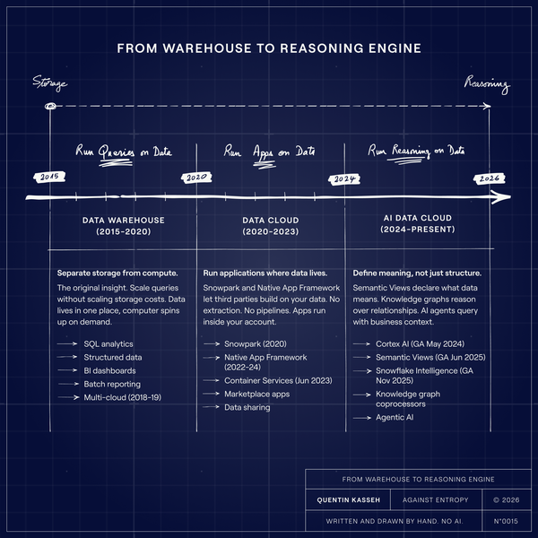
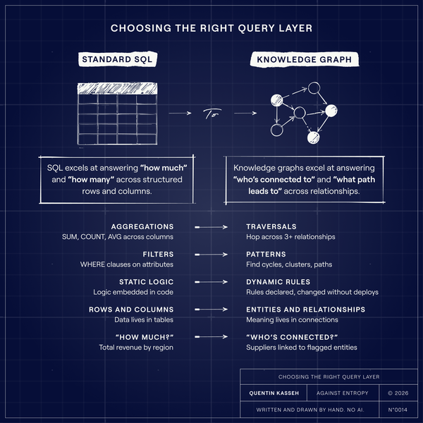

*From data warehouse to reasoning engine.*

****Disclosure:**** **I was Director of Engineering at RelationalAI. I've been following knowledge graphs and declarative databases for over a decade.** *****What follows isn't a sales pitch. It's an honest assessment of where this technology actually is and whether it's worth your time*******.**

Last month*,* I saw a LinkedIn post that caught my attention. [Greg Macpherson](https://www.linkedin.com/in/gregmacpherson/?ref=kasseh.com) had built a knowledge graph to model the Great Artesian Basin, one of the largest freshwater aquifers in the world. The graph connected the Australian federal government, four state governments, BHP, Rio Tinto, aboriginal corporations, the Bureau of Meteorology, environmental legislation, and water rights.

All running inside [Snowflake](https://www.snowflake.com/en/developers/guides/getting-started-with-graphrag-and-relationalai/?ref=kasseh.com). No external graph database. No data movement.

I've seen a lot of knowledge graph demos. Most are toys. This one modeled 1.7 million square kilometers of underground water across multiple jurisdictions, with real stakeholders and real regulatory constraints.

It made me think it's worth explaining what's actually possible now, and what's still hard.

## What Changed in Snowflake

**Ten years ago**, Snowflake was a cloud data warehouse with a clever architecture: separated storage and compute. You could scale query capacity without scaling storage costs. Revolutionary for its time, but still fundamentally a place to run SQL against structured data.

**Today**, Snowflake calls itself the "AI Data Cloud". That's marketing language, but the underlying capabilities are real.



Snowflake evolution from a warehouse to allowing reasoning and AI

#### ****Native App Framework and Snowpark Container Services.****

Snowflake now [lets third parties](https://docs.snowflake.com/en/developer-guide/native-apps/native-apps-about?ref=kasseh.com) run containerized applications directly inside your Snowflake account. Your data never leaves. The compute runs where the data lives.

****This is the architectural foundation that makes knowledge graphs possible without data extraction.****

#### Cortex AI

Snowflake embedded LLMs directly into the platform. You can run [sentiment analysis, summarization, and text generation using SQL functions](https://docs.snowflake.com/en/guides-overview-ai-features?ref=kasseh.com). More importantly, Cortex Analyst lets business users query data in natural language, with the SQL generated automatically based on semantic models you define.

#### ****Semantic Views (June 2025)****

Announced at Summit 2025, [semantic views are schema-level objects](https://docs.snowflake.com/en/user-guide/views-semantic/overview?ref=kasseh.com) that define what your data means, not just what it contains. You declare that `amt\_ttl\_pre\_dsc` is actually "gross revenue" and that "net revenue" means gross revenue after discounts. These definitions persist, get governed, and power AI applications.

#### ****Snowflake Intelligence**** (November 2025)

Launched in [November 2025](https://www.snowflake.com/en/developers/guides/getting-started-with-snowflake-intelligence/?ref=kasseh.com), this is an agentic AI layer that lets anyone in your organization ask questions of data conversationally. ****It combines Cortex Analyst, Cortex Search, and AI agents**** that connect to semantic views and models.

The pattern is clear. Snowflake is building the infrastructure for meaning, not just storage.

Data warehouses hold facts. AI Data Clouds understand what those facts mean.

## How Knowledge Graphs Actually Work on Snowflake

Here's where it gets interesting. [RelationalAI](https://www.relational.ai/?ref=kasseh.com) runs as a native app inside Snowflake. It's not a separate graph database. It's aknowledge graph **coprocessor** that creates graph indexes over your existing Snowflake tables. When you query relationships, it reasons over the graph. When you need results, they write back to Snowflake tables that anyone can access with SQL.  
  
Here's what the workflow actually looks like:

### Step 1: Install from Snowflake Marketplace

It's a native app, so no separate infrastructure. Takes about 15 minutes to get running.

### Step 2: Define your ontology in Python

This is where you specify what entities exist and how they relate. A simplified example:

```
from relationalai import Model
model = Model("supply_chain")

# Define entity types
Supplier = model.Type("Supplier")
Product = model.Type("Product")
Warehouse = model.Type("Warehouse")

# Define relationships
supplies = model.Relation("supplies", Supplier, Product)
stored_at = model.Relation("stored_at", Product, Warehouse)

# Map to your Snowflake tables
with model.rule():
    Supplier.add(id=suppliers_table.supplier_id)
    Product.add(sku=products_table.sku)
    supplies.add(
      Supplier(id=s.supplier_id), 
      Product(sku=s.product_sku)
    )
```

supply\_chain\_ontology.py
[View on GitHub](https://gist.github.com/mr-ouss/389002368fa0422452acd2d0ad366f53?ref=kasseh.com)

### Step 3: The graph materializes over your existing tables

No ETL. No data extraction. RelationalAI creates indexes that let it traverse relationships efficiently while your data stays in Snowflake.

### Step 4: Query with graph patterns or export to SQL-accessible tables

Results write back to Snowflake tables that anyone can query with standard SQL.

💡

****The key insight:**** you're not replacing your warehouse. You're adding a reasoning layer on top of it.

**This eliminates** the traditional knowledge graph **adoption problem:** you don't need to convince your organization to adopt a new database, learn SPARQL or Cypher, or build integration pipelines. You install an app from the Snowflake Marketplace and start modeling.

## Where This Actually Helps

Knowledge graphs are overkill for most analytics. Here's where they're worth the complexity:



Choosing the right tool for the right job

### Multi-Hop Relationship Queries

If you're writing recursive CTEs to traverse relationships, that's a signal. Examples:

- "Find all suppliers who share a warehouse with a supplier flagged for compliance issues"
- "Trace the ownership chain from this shell company to its ultimate beneficial owner"
- "Which customers are connected to this fraud cluster through shared devices, addresses, or phone numbers?"

**In SQL, these queries get ugly fast**. A three-hop traversal might be 50+ lines of recursive CTEs. In a graph, it's a pattern match.

### When Rules Change Faster Than Code

[Blue Yonder's case is instructive](https://blueyonder.com/why-blue-yonder/ai-and-machine-learning?ref=kasseh.com). They had thousands of lines of imperative supply chain logic. Every business rule change meant modifying code, testing, deploying.

With a knowledge graph, rules become declarative:

```
with model.rule():
# If a product is low stock and its primary supplier 
# has a disruption, flag for expedited reorder
    product = Product()
    supplier = Supplier()
    supplies(supplier, product)
    product.stock_level < product.reorder_threshold
    supplier.has_active_disruption == True
    product.set(expedite_reorder=True)
```

expedite\_reorder\_rule.py
[View on GitHub](https://gist.github.com/mr-ouss/d85262f91e333920021107fd2abe7cfb.js?ref=kasseh.com)

When the business wants to change the reorder threshold logic, you change the rule. You don't refactor a codebase.

They reported 90% reduction in legacy code. That number is real, but context matters: they were replacing a particularly gnarly legacy system. Your mileage will vary.

### Network-Based Fraud Detection

Traditional fraud detection looks at individual transactions. Graph-based detection looks at networks.

[Cash App uses RelationalAI for customer intelligence](https://www.relational.ai/post/rai-debuts-ka-coprocessor-as-snowflake-native-app?ref=kasseh.com). They run algorithms like **PageRank** and **community detection** to identify clusters of related accounts. An account that looks clean in isolation might be connected to three accounts previously involved in fraud.

The practical workflow:

1. Model accounts, transactions, devices, addresses, phone numbers as a graph
2. Run community detection to find clusters
3. Compute risk scores based on network position
4. Export scores back to Snowflake tables for downstream use

What used to take their team days now runs in minutes.

## What's Still Hard

Let me be direct about the limitations:

**Ontology design requires upfront work.** Someone has to decide what entities exist, how they relate, and what rules apply. This isn't a tool you install and forget. Budget time for modeling, and expect to iterate. Possible that LLM helps with discovery of the ontology (still to be proven in production, but work here is promising).

**The learning curve is real.** Most data engineers think in SQL. Declarative graph reasoning is a different paradigm. Plan for training.

**Costs scale with complexity.** Running graph algorithms over large datasets consumes compute. For a simple dashboard query, traditional SQL is cheaper. Knowledge graphs make sense when relationship complexity justifies the overhead.  
I've seen teams try to graph everything. **Don't**. Start with a specific, relationship-heavy problem where you're already feeling pain.

**The ecosystem is still maturing.** RelationalAI is the most production-ready option on Snowflake right now. Alternatives like **Neo4j** or **TigerGraph** require data extraction. The tooling is improving, but you're still relatively early if you adopt this.

## When NOT to Use This

Skip knowledge graphs if:

- Your queries are mostly aggregations and filters (standard SQL is fine)
- You don't have a clear relationship-traversal use case
- You can't invest time in ontology design
- Your team isn't willing to learn a new paradigm

Seriously. I've spent a decade on this technology. It's powerful when applied correctly and a waste of time when forced onto problems that don't need it.

## Getting Started Without Boiling the Ocean

If you're curious, here's a practical path:

#### Week 1: Identify a candidate problem

Look for pain. Where are you writing recursive CTEs? Where do analysts complain that "it's hard to see connections"? Fraud, supply chain, customer networks, and regulatory compliance are common fits.

#### ****Week 2: Try Snowflake semantic views****

Even without RelationalAI, you can start defining what your data means. Build semantic views for core business metrics. This is useful regardless of whether you pursue knowledge graphs.

#### ****Week 3: Run the RelationalAI quickstart****

There's [a public tutorial](https://docs.relational.ai/build/guides/basic-functionality?ref=kasseh.com) on building a knowledge graph for question answering. It walks through installation, creating a simple graph, and running queries. Takes a few hours.

#### ****Week 4: Model a small slice of your actual problem****

Don't try to graph your entire domain. Pick one relationship-heavy workflow and model just that. See if the complexity is worth it for your use case.

## The Honest Assessment

Knowledge graphs on Snowflake represent a real capability that didn't exist a few years ago. Running graph reasoning where your data already lives, without extraction pipelines, is a meaningful improvement over the old approach of standing up a separate graph database and keeping it in sync.

Is it transformative? **For the right problems, yes**. Blue Yonder's 90% code reduction is real. Cash App's fraud detection improvements are real. The Great Artesian Basin governance model solves a problem that would be genuinely hard to solve any other way.

Is it for everyone? **No.** Most companies don't have problems that justify this level of architectural investment. If your SQL is working fine, keep using SQL.

**The shift I see is this:** Snowflake is becoming a platform, not just a warehouse. Knowledge graphs are one application of that platform capability. Semantic views are another. Cortex AI is another. The companies that figure out which capabilities actually solve their problems, without getting distracted by hype, will be the ones who benefit.

The Great Artesian Basin has been forming for 2 million years. It takes a million years for water to flow from entry to exit.

The knowledge graph that models it was built in weeks.

That's impressive. Whether you need something like that is a different question.

---

*This is the kind of analysis I publish in Against Entropy. If you're building data systems and want practical frameworks **for problems the vendors won't talk about**, subscribe below.*

💡

****A note on process****  
Everything you just read was written by a human.   
The illustrations were drawn by hand. I don't use AI to generate content for Against Entropy.   
If you want to know why, or how these essays come together, [here's the process.](https://www.kasseh.com/why-i-dont-use-ai-to-write/)
