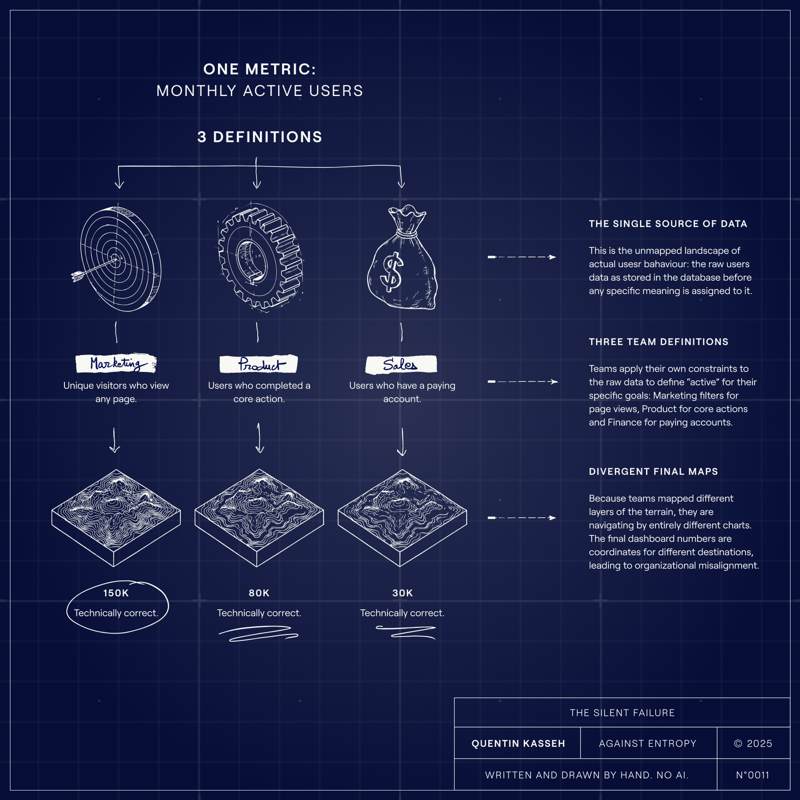
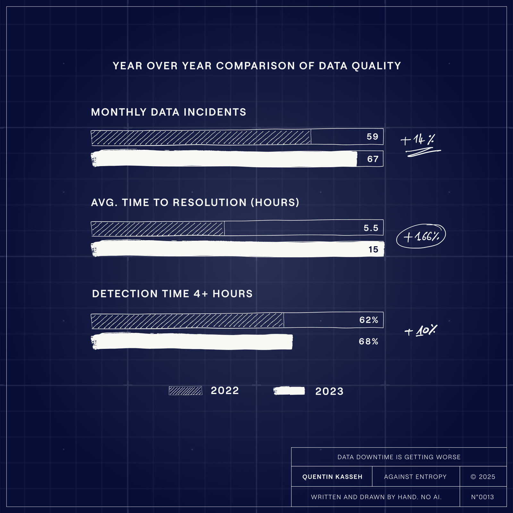
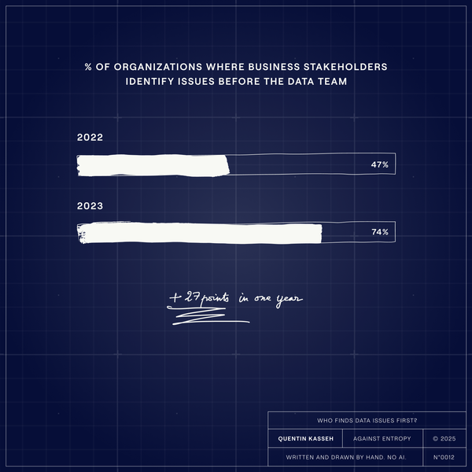

There are two ways your data can fail you. One is **loud**. The other is **silent**. The entire data industry has organized itself around the loud one.

This is a mistake.

## Syntactic Drift vs Semantic Drift

When a column disappears from your database, your pipeline breaks. You get an alert. Someone curses at 300, fixes it, and moves on. The system worked.

When the meaning of a column changes but its name stays the same, nothing breaks. Your dashboards render. Your tests pass. Your executives make decisions. They just make them on data that no longer means what they think it means.

The first kind of failure is **syntactic**. The structure changed. The second kind is [**semantic**](https://grokipedia.com/page/Semantic_change?ref=kasseh.com). The meaning changed.

We have spent a decade building tools for the first kind. We have almost nothing for the second. And the second is the one that actually destroys companies.

## How Semantic Drift Corrupts Business Decisions

Let me make this concrete.

Three teams at a company track **Monthly Active Users**.

Marketing counts unique visitors who viewed any page.

Product counts users who completed a core action.

Finance counts users tied to a paying account.

All three teams have dashboards. All three show a metric called **MAU**. All three numbers are different. All three are correct according to their local definition.

This is already a problem. But it gets worse.

One metric, three definitions

One quarter, Product decides that viewing the settings page no longer counts as a core action. They update their tracking. Their MAU drops 15%. No one outside Product knows this happened.

What breaks? Nothing. The column is still called **mau**. The data type is still integer. The schema tests pass. The data contract holds.

But now Product is making roadmap decisions based on a metric that quietly diverged from what it meant six months ago.

Think of it like three cartographers mapping the same mountain. Each produces a **topographic map with identical contour lines. But each calibrated their instruments differently**. One shows the peak at 14,200 feet. Another at 8,900. The third at 5,200.

**All three maps** pass inspection. And if you tried to coordinate a rescue using all three, you would send teams to three different elevations.

The structure is identical. The meaning has diverged.

[Subscribe for More](#/portal/signup/free)

## Why Data Quality Tools Miss Semantic Drift

The modern data stack is very good at catching structural problems.

- [dbt](https://www.getdbt.com/?ref=kasseh.com) gives you schema tests and [data contracts](https://grokipedia.com/page/Data_build_tool?ref=kasseh.com).
- [Fivetran](https://www.fivetran.com/?ref=kasseh.com) and [Airbyte](https://airbyte.com/?ref=kasseh.com) send alerts when columns appear or disappear.
- [Monte Carlo](https://www.montecarlodata.com/?ref=kasseh.com) watches for freshness and volume anomalies.
- [Matillion](https://www.matillion.com/?ref=kasseh.com) stops pipelines when schemas diverge.

All of this is useful. None of it catches semantic drift.

Despite a decade of investment in data quality tooling, the problem is getting worse. A 2023 survey by **Wakefield Research** ([link to source data](https://www.businesswire.com/news/home/20230502005377/en/Data-Downtime-Nearly-Doubled-Year-Over-Year-Monte-Carlo-Survey-Says?ref=kasseh.com)) found that monthly data incidents rose from 59 to 67 year over year. Average time to resolution jumped 166%, from under 6 hours to 15!

💁

Translation: The tools got better. The outcomes got worse.

Data Downtime is Getting Worse

In 2022, business stakeholders identified data issues first 47% of the time. By 2023, that number hit 74%. The data team is not catching problems. The business is.

Who Finds Data Issues First? (2022 vs 2023)

When vendors say "drift detection", they mean structural drift. They mean syntactic changes. They have no answer for semantic changes because semantic changes do not show up in metadata.

You cannot write a test for "this column still means what the business thinks it means".

The meaning lives in someone's head. Often in several heads, each with a slightly different version.

## Ontologies and Knowledge Graphs Already Solved This

Here is the part the industry does not want to hear, or don't want to face, yet.

This problem was solved decades ago. [Ontologies](https://grokipedia.com/page/Ontology_(information_science)?ref=kasseh.com) and [Knowledge graphs](https://grokipedia.com/page/Knowledge_graph?ref=kasseh.com). Formal knowledge representation. The entire field exists precisely to capture meaning, not just structure.

[Dave McComb](https://www.semanticarts.com/?ref=kasseh.com) has been writing about this for years. His argument is simple: most enterprise data problems come from treating applications as primary and data as a byproduct.

Every system defines its own vocabulary. "Customer" means something different in **Salesforce** than in your billing system than in your warehouse. We spend enormous effort reconciling these definitions downstream.

The alternative is to define your concepts once, formally, in an [ontology](https://grokipedia.com/page/Applied_ontology?ref=kasseh.com). "Customer" has explicit relationships to "Account" and "Contract" and "Transaction". These are not column names in the physical world. They are semantic definitions that encode what things mean and how they relate.

If your ontology defines "active" as "logged in within 30 days", and someone wants to change that, they have to change the ontology. That change is versioned, visible, and propagates everywhere. You cannot quietly and simply update tracking logic in one system and have the meaning silently diverge.

This actually solves semantic drift.

## Why Data-Centric Architecture Remains Rare

So why does almost no one do this?

Because it requires the entire enterprise to commit to being [data-centric](https://www.semanticarts.com/the-data-centric-revolution/?ref=kasseh.com). You cannot slap or bolt an ontology onto one team and call it done. The value comes from shared semantics across the organization. That means executive sponsorship, cross-functional governance, and years of work.

Most companies want a tool. They want something to install, configure, and check off a list.

Ontology-driven architecture is not a tool. It is a worldview.

The vendors know this. Selling schema tests is easy. Selling "restructure your entire relationship with data" is **nearly impossible**. So the industry keeps shipping incremental improvements to syntactic detection while ignoring the deeper problem.

## Practical Ways to Reduce Semantic Drift

If your organization is not ready for that transformation, you can still reduce semantic drift. Here is what works:

- **Metric registries with enforced ownership.** Every business-critical metric has an owner. Changes require approval. This sounds bureaucratic until you realize the alternative is silent data corruption.
- **Definition-as-code with mandatory context.** The calculation lives in version control. But so does the business context: why this definition exists, what assumptions it encodes, when it was last validated against business intent.
- **Regular reconciliation rituals.** Quarterly sessions where data teams sit with business stakeholders and verify that the numbers still mean what everyone thinks they mean. Tedious. Essential.
- **Semantic versioning for metrics.** When a metric definition changes materially, it gets a new version. The old definition remains available for historical comparison. Downstream consumers must explicitly opt into the new version.

These are management strategies. They treat the symptom, not the disease.  
But they are achievable **without a 5 year transformation program**.

## The Questions Data Leaders Cannot Answer

When I talk to data leaders, I ask two questions.

First: When was the last time you verified that your top five metrics still mean what your executives think they mean?

The honest answer is usually "never" or "I don't know".

Second: Would your organization commit to defining business concepts formally and governing them across every system?

The honest answer is usually a long pause or "that would be hard".

That is the gap. Not schema tests. Not data contracts. Not observability platforms. We have industrialized the detection of structural failures while ignoring the silent corruption of meaning.

**Syntactic drift is solved**. The tools exist. The industry has moved on.  
Semantic drift has a solution too. Ontologies. Knowledge graphs. [Data-centric architecture](https://grokipedia.com/page/Data-centric_architecture?ref=kasseh.com).

The theory is mature. The technology works. But adoption requires treating data as a strategic asset instead of a byproduct.

Until that happens, we will keep building dashboards that lie to us politely.

The data does not break. It just stops being true.

---

*This is the kind of analysis I publish in Against Entropy. If you're building data systems and want practical frameworks **for problems the vendors won't talk about**, subscribe below.*

💡

****A note on process****  
Everything you just read was written by a human.   
The illustrations were drawn by hand. I don't use AI to generate content for Against Entropy.   
If you want to know why, or how these essays come together, [here's the process.](https://www.kasseh.com/why-i-dont-use-ai-to-write/)
